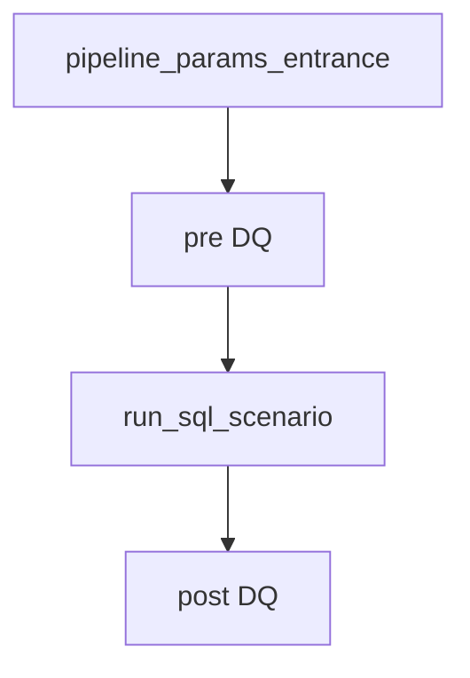

# Pipeline YAML

Pipelines live in `<group_root>/pipelines/*.yaml`. One file = one `pipeline_name`.

## Top-level shape

```yaml
pipeline_name: my_report_v1
pipeline_tags: [finance, dq]    # or under _meta.pipeline_tags
display_name:                   # optional human title (string or list)
  - Sales report
description:                    # optional multi-line blurb for Pipelines registry
  - Builds the marketplace sales report
  - from WB and OZON exports
_meta:
  launch_order_mode: declaration   # declaration | auto_lpt
jobs:
  - job_name: ...
```

Optional `display_name` / `title` (and `_meta.alias` / `_meta.display_name`) become the primary label in the Pipelines registry; `pipeline_name` stays the technical id (shown as secondary text). `description` is shown in the Description column when set. Values may be a plain string or a YAML list of lines.

Job node aliases accepted by validator: `name`/`id`, `path`/`job_path`/`module`, `deps`/`depends_on`.

## Input sources

| Source | YAML | Semantics |
|--------|------|-----------|
| Task input | `initial` or `from: initial` + optional `key` | `initial_input_json` |
| Upstream | `job: <name>` + `key: <field>` | Prior job stdout JSON |
| Literal | `from: const` + `value:` | Fixed at schedule time |

Shorthand: `inputs: { number: initial }` equals `from: initial` for that field.

### Merge (shared job across pipelines)

```yaml
inputs:
  payload:
    merge:
      - from: job
        job: prepare
        key: payload
      - from: const
        value: { profile: email }
      - from: initial
        key: payload
    priority: [job, const, initial]   # higher index wins on key conflict
    deep_merge: true
```

- Different keys → merged additively.
- `priority` applies only to **overlapping** keys.
- Missing `initial` key inside merge is soft-absent (const/job can still apply).

Demo: `examples/pipelines/demo_shared_job_payload_merge.yaml`.

## Outputs and deps

```yaml
deps: [upstream_job]           # [] for entry nodes (or synthetic entrance — see below)
outputs: [params, summary]     # keys exposed from stdout JSON
```

- Graph must be **acyclic**.
- Downstream `inputs` reference `outputs` keys, not arbitrary nested paths unless the whole object is one output key.

## Execution controls

### Parallel launch order

```yaml
_meta:
  launch_order_mode: auto_lpt   # longest predicted duration first when concurrency limited
```

### Run after upstream failure

```yaml
run_on_upstream_failure: true   # cleanup, notify, noop barriers
```

Demo notify: `examples/pipelines/demo_notify_channel_modes.yaml`.

### Retry policy

```yaml
retry_policy:
  mode: fixed            # fixed | exponential
  max_attempts: 3
  delay_sec: 60
  max_delay_sec: 300
```

Runnable demo: `examples/pipelines/demo_core_showcase.yaml` (`demo_retry_recovery` job has `retry_policy` with `mode: exponential`).

## Synthetic entrance

When multiple jobs have `deps: []`, the platform may inject `__dagychu_entrance` so the graph has one formal entry. Do not name your jobs `__dagychu_entrance`.

## Production orchestration (entrance, DQ, SQL) — best practice

**Optional** pattern for **analytics/data projects** that already ship jobs under `utils/`, SQL in `data_transformation/`, and DQ files. Ordinary Python/Bash pipelines do **not** need this section.



### 1. pipeline_params_entrance

- Path: `utils/pipeline_params_entrance/latest/main.py`
- `deps: []`, `outputs: [params]`
- **Only entrance** reads `initial_input_json` via merge; workers get `params` via `job: pipeline_params_entrance`.

```yaml
# initial_input_json must be {"params": {"month_offset": 0}} — not bare keys at root

inputs:
  params:
    merge:
      - from: const
        value:
          month_offset: 0
      - from: initial
        key: params
    priority: [initial, const]
    deep_merge: true
```

Downstream:

```yaml
params:
  job: pipeline_params_entrance
  key: params
```

Jobs without period params (static DQ catalog) omit `params` — only `sql_path`, `test_name`, `group_name`.

### 2. DQ job (`utils/dq_runner`)

```yaml
- job_name: dq_sources_pre
  path: utils/dq_runner/latest/main.py
  deps: [pipeline_params_entrance]
  outputs: [summary, checks, result]
  inputs:
    sql_path:
      merge:
        - from: const
          value: dq/tests/<domain>/<schema.table>.dq.sql
    test_name:
      merge:
        - from: const
          value: <unique_test_name>
    group_name:
      merge:
        - from: const
          value: <group_for_summary_view>
    params:                    # only if SQL uses Jinja params
      job: pipeline_params_entrance
      key: params
```

Add DQ pre for **each** source/reference table before transform; post DQ on **target mart** after write.

### 3. Noop barrier after pre-DQ

```yaml
- job_name: noop_after_pre_dq
  path: utils/run_sql_scenario/latest/main.py
  deps: [dq_a, dq_b]
  run_on_upstream_failure: true
  outputs: [result]
  inputs:
    sql_text:
      merge:
        - from: const
          value: "select 1 as ok;"
```

### 4. run_sql_scenario (transform)

```yaml
params:
  job: pipeline_params_entrance
  key: params
```

SQL paths point to `data_transformation/...sql` with Jinja placeholders filled from `params`.

### New data-pipeline checklist

1. Entrance + header comment documenting `initial_input_json`.
2. Pre-DQ per source table.
3. Transform SQL job(s).
4. Post-DQ on target mart.
5. `pipeline_tags` includes `dq` when checks present.
6. `GRANT SELECT` on DQ tables for service DB role if applicable.
7. Document `test_code` and thresholds for operators.

## Validation

Always validate before deploy:

- UI: **Pipelines** → validate action for the group
- Fix cycles, missing deps, bad paths, and invalid input kinds in YAML
